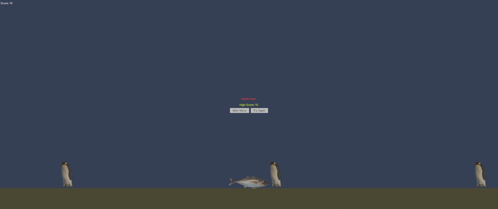

# Infinity Runner Prototype

Small 2D game prototype created in Unity, where the player must jump over obstacles in an infinite environment and accumulate points.

## 🎮 Features

- Automatic character movement
- Ground-sensing jumping
- Automatically generated obstacles
- Survival-based scoring system

## 🖼️ Images

## 🚀 How to play

1. Clone the project:
git clone https://github.com/VitorSousaS/InfinityRunnerPrototype.git

2. Open Unity Hub and select the folder.
3. Open the `MainScene` scene.
4. `Play` to run the game.

## 📦 Build

Playable version for Windows available in the Releases tab (or via manual build via Unity).

## 👨‍💻 Made by

[Vitor de Sousa Santos](https://www.linkedin.com/in/vitor-de-sousa-santos/)